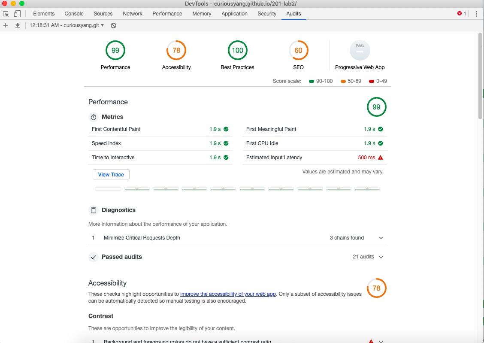

# 201-lab2
User Stories and Feature Tasks
As a jobseeker, I would like for potential employers to quickly learn a few things about me, where I am from, my current job, my education, my preference, and my goals.
As a developer, I want to use thoughtful and descriptive console.log() statements throughout my code to help test my work and assist with debugging.

